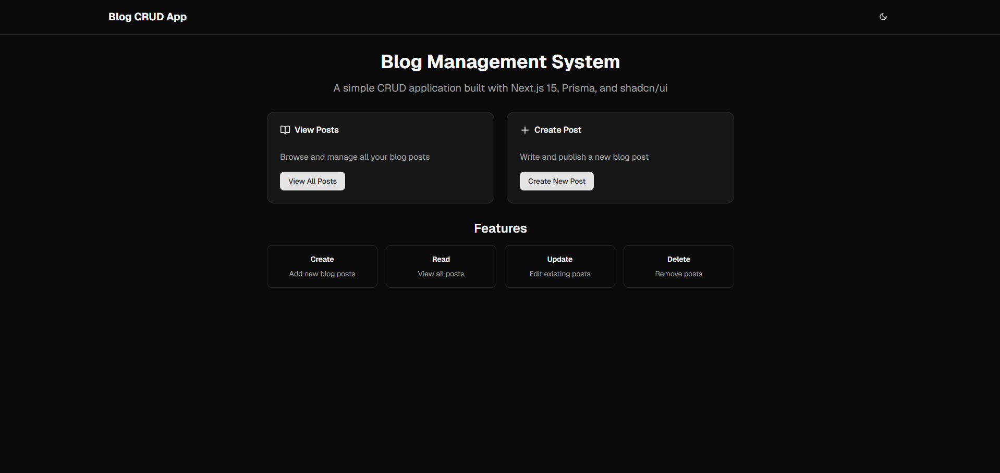

# Simple Nextjs App Router Blog CRUD Operation Project Prisma



This project is a **Blog Management System** built with the latest technologies in the React and Node.js ecosystem. It provides a clean, modern, and responsive interface for creating, reading, updating, and deleting blog posts. The application is designed for developers, bloggers, or anyone who wants a simple yet powerful platform to manage content.

## Key Technologies

- **Next.js 15**: App Router, SSR, and file-based routing.
- **Prisma ORM**: Database access and migrations (default: SQLite).
- **React 19**: Modern, interactive UI.
- **shadcn/ui & Radix UI**: Accessible, customizable UI components.
- **Tailwind CSS**: Utility-first CSS framework.
- **TypeScript**: Type safety and better developer experience.
- **Lucide React**: Modern icons.

## Features

- **CRUD Operations**: Create, read, update, and delete blog posts.
- **Modern UI**: Responsive design, dark mode, clean layouts.
- **Server-Side Rendering**: Fast, SEO-friendly.
- **Database Integration**: Prisma + SQLite (easy to switch DBs).
- **Developer Experience**: Easy setup, linting, type checking.

## Folder Structure

```
.
├── app/
│   ├── layout.tsx
│   ├── not-found.tsx
│   ├── page.tsx
│   ├── globals.css
│   ├── favicon.ico
│   ├── generated/
│   └── posts/
│       ├── page.tsx
│       ├── new/
│       │   └── page.tsx
│       └── [id]/
│           ├── page.tsx
│           └── edit/
│               └── page.tsx
├── components/
│   ├── mode-toggle.tsx
│   ├── post/
│   │   ├── post-card.tsx
│   │   └── post-form.tsx
│   └── ui/
│       ├── alert-dialog.tsx
│       ├── badge.tsx
│       ├── button.tsx
│       ├── card.tsx
│       ├── dropdown-menu.tsx
│       ├── input.tsx
│       ├── label.tsx
│       ├── sonner.tsx
│       ├── switch.tsx
│       └── textarea.tsx
├── lib/
│   ├── prisma.ts
│   ├── utils.ts
│   ├── actions/
│   │   └── post.actions.ts
│   └── types/
│       └── post.ts
├── prisma/
│   ├── dev.db
│   ├── schema.prisma
│   └── migrations/
├── public/
│   ├── screenshot/
│   │   └── index.png
│   ├── file.svg
│   ├── globe.svg
│   ├── next.svg
│   ├── vercel.svg
│   └── window.svg
├── package.json
├── tsconfig.json
├── .env
├── README.md
└── ...
```

This is a [Next.js](https://nextjs.org) project bootstrapped with [`create-next-app`](https://nextjs.org/docs/app/api-reference/cli/create-next-app).

## Available Routes

### Main Routes

- **/**  
  The home page. Provides an introduction to the Blog Management System and quick links to view all posts or create a new post.

- **/posts**  
  Displays a list of all blog posts. Users can browse, view, and access actions for each post. If no posts exist, users are prompted to create their first post.

- **/posts/new**  
  Presents a form to create a new blog post. Users can enter a title, content, and choose to publish or save as draft.

### Dynamic Post Routes

- **/posts/[id]**  
  Displays the details of a single post, including its title, content, creation and update dates, and published status. Users can navigate back to the posts list or proceed to edit the post.

- **/posts/[id]/edit**  
  Presents a form pre-filled with the post's current data, allowing users to edit and update the post.

**Note:**

- All routes are built using Next.js App Router and leverage server-side rendering for data fetching.
- The post management features (Create, Read, Update, Delete) are implemented using Prisma as the ORM and a SQLite database by default.
- The UI is built with shadcn/ui, Radix UI, and Tailwind CSS for a modern, accessible design.

## Getting Started

First, run the development server:

```bash
npm run dev
# or
yarn dev
# or
pnpm dev
# or
bun dev
```

Open [http://localhost:3000](http://localhost:3000) with your browser to see the result.

You can start editing the page by modifying `app/page.tsx`. The page auto-updates as you edit the file.

This project uses [`next/font`](https://nextjs.org/docs/app/building-your-application/optimizing/fonts) to automatically optimize and load [Geist](https://vercel.com/font), a new font family for Vercel.

## Learn More

To learn more about Next.js, take a look at the following resources:

- [Next.js Documentation](https://nextjs.org/docs) - learn about Next.js features and API.
- [Learn Next.js](https://nextjs.org/learn) - an interactive Next.js tutorial.

You can check out [the Next.js GitHub repository](https://github.com/vercel/next.js) - your feedback and contributions are welcome!

Check out our [Next.js deployment documentation](https://nextjs.org/docs/app/building-your-application/deploying) for more details.
